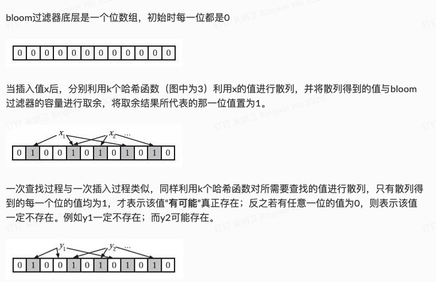

# 布隆过滤器（Bloom Filter）
Bloom Filter是一种空间效率很高的随机数据结构，它利用位数组很简洁地表示一个集合，并能判断一个元素是否属于这个集合。Bloom Filter的这种高效是有一定代价的：在判断一个元素是否属于某个集合时，有可能会把不属于这个集合的元素误认为属于这个集合（false positive）。因此，Bloom Filter不适合那些“零错误”的应用场合。而在能容忍低错误率的应用场合下，Bloom Filter通过极少的错误换取了存储空间的极大节省。

布隆过滤器的核心：如果计算出有一个元素已存在，那么它可能存在，如果一个元素不存在，那么它一定不存在

## 主要作用

## 结构


## 数学结论
首先，与布隆过滤器准确率有关的参数有：

- 哈希函数的个数k；
- 布隆过滤器位数组的容量m;
- 布隆过滤器插入的数据数量n;

主要的数学结论有：

- 为了获得最优的准确率，当k = ln2 * (m/n)时，布隆过滤器获得最优的准确性；
- 在哈希函数的个数取到最优时，要让错误率不超过є，m至少需要取到最小值的1.44倍；

## 开源实现
GO: https://github.com/bits-and-blooms/bloom

### 关键代码
```Go
// EstimateParameters estimates requirements for m and k.
// Based on https://bitbucket.org/ww/bloom/src/829aa19d01d9/bloom.go
// used with permission.
// 布隆过滤器准确率: 通过（n:元素数量， p：错误率）计算出 bitset的长度m 和hash function的数据量k
func EstimateParameters(n uint, p float64) (m uint, k uint) {
	m = uint(math.Ceil(-1 * float64(n) * math.Log(p) / math.Pow(math.Log(2), 2)))
	k = uint(math.Ceil(math.Log(2) * float64(m) / float64(n)))
	return
}
```


## 测试
